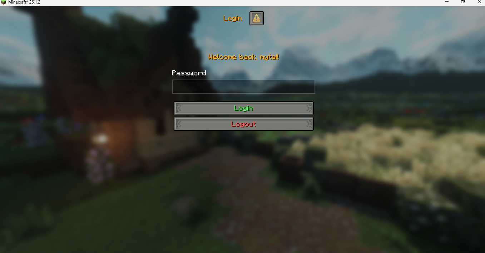
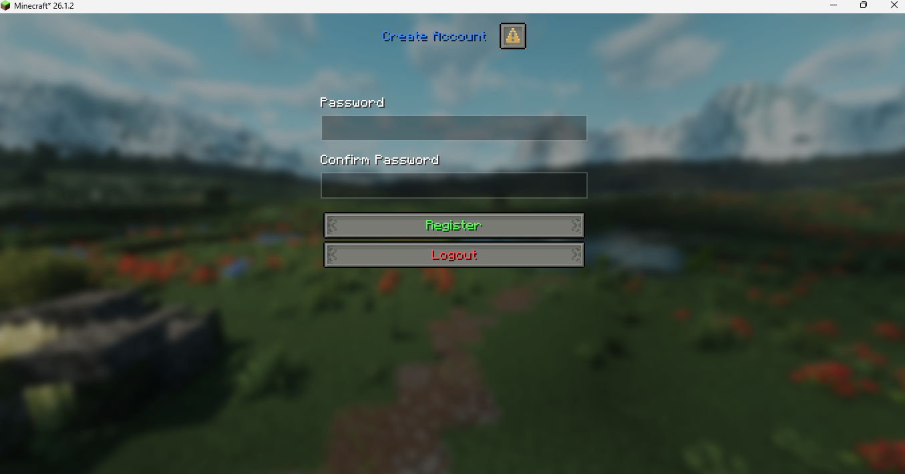
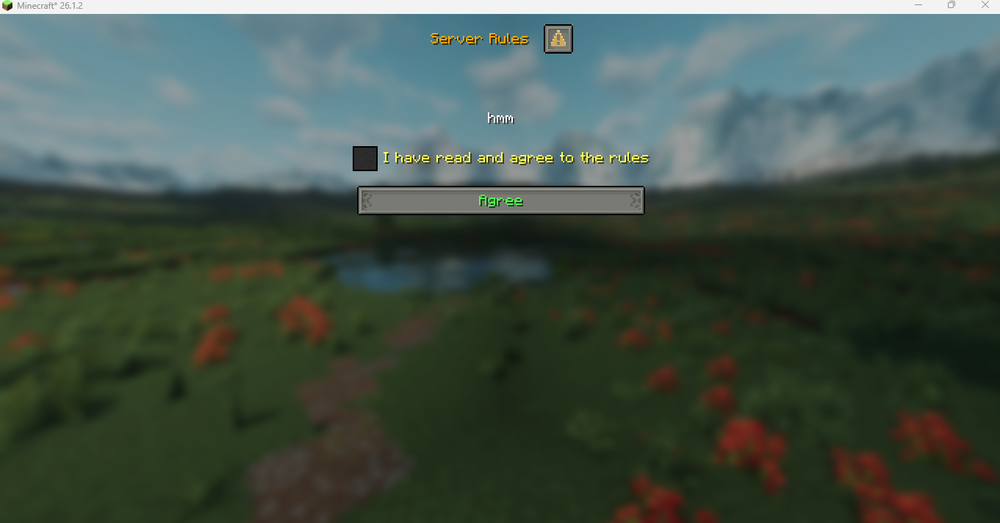
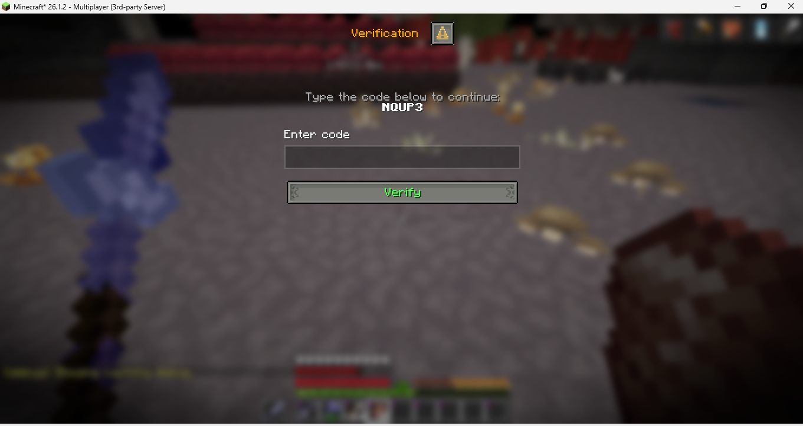
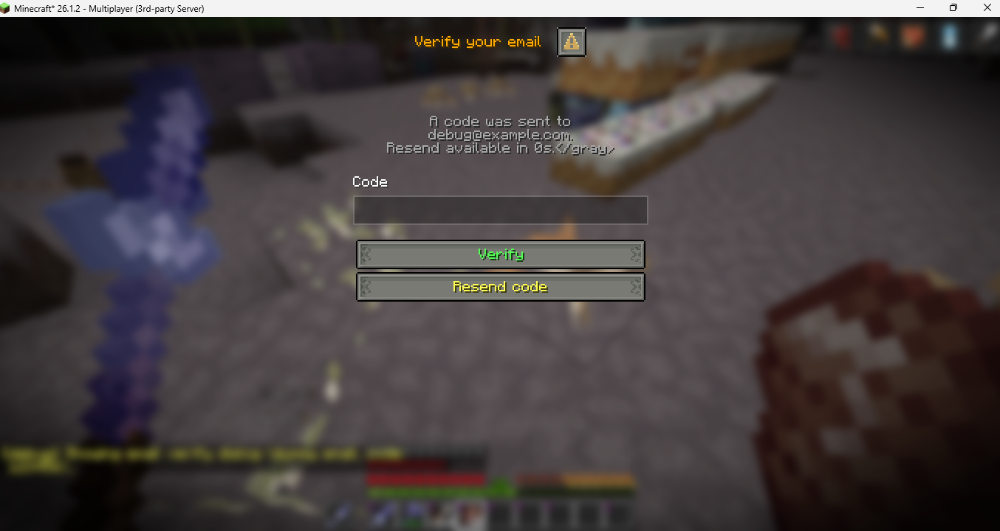
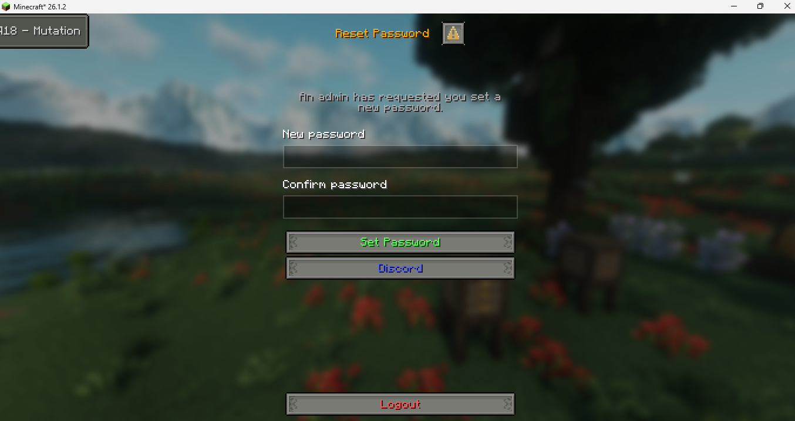
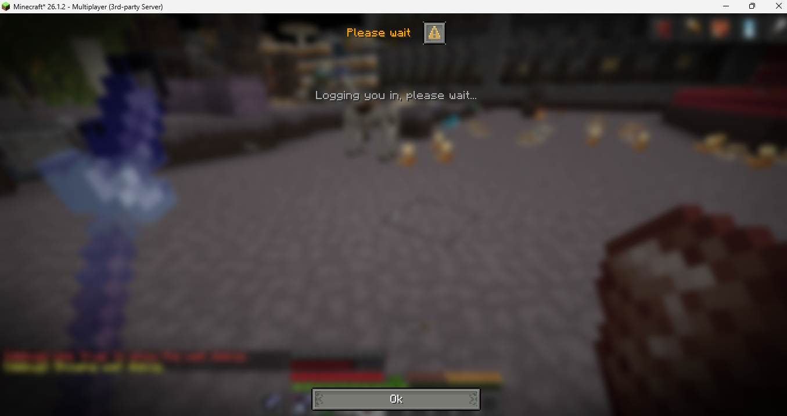
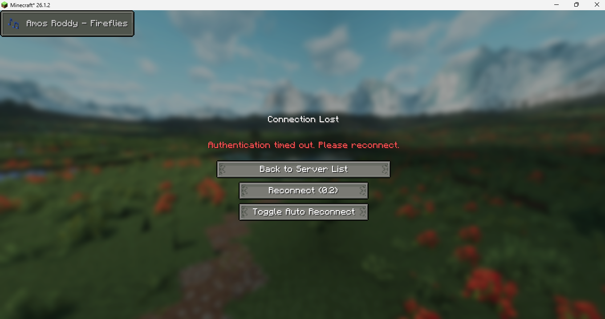
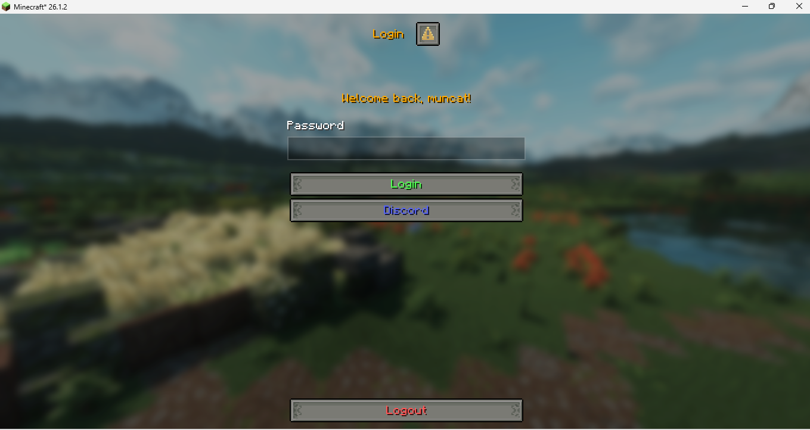

<div align="center">


# authmebia

A addon for AuthMe Reloaded that replaces chat-based login and register prompts with native Minecraft dialogs (1.21.6+). Players interact through proper GUI windows instead of typing commands in chat.

[GitHub](https://github.com/Mytai20100/authmebia)
</div>

---

<details>
<summary>Login</summary>



</details>

<details>
<summary>Register</summary>



</details>

<details>
<summary>Rules</summary>



</details>

<details>
<summary>Captcha</summary>



</details>

<details>
<summary>Email Verification</summary>



</details>

<details>
<summary>Password Recovery</summary>



</details>

<details>
<summary>Wait</summary>



</details>

<details>
<summary>Login Timeout</summary>



</details>

<details>
<summary>Buttons / Links</summary>



</details>

---

## Requirements

- Paper 1.21.6 or newer
- AuthMe Reloaded 6.0.0
- Java 21

---

## Features

**Dialog modes**
- Pre-spawn dialog mode: the login or register window blocks the connection phase, so the player spawns already authenticated
- Post-spawn dialog mode: the window appears after the player joins the world
- Three auth input modes: password text field, numeric PIN grid, or per-digit slider

**Authentication**
- Premium bypass: players whose UUID matches a premium account stored in AuthMe are detected automatically and skip all dialogs entirely
- TOTP / 2FA dialog for players who have an authenticator app set up in AuthMe
- Captcha dialog synced with AuthMe's captcha setting
- Email verification dialog on registration (reuses AuthMe's SMTP config)
- Admin-forced password recovery: use `/bia recover <player>` to flag an account; the player is shown a reset dialog on their next login or immediately if they are already online
- Server rules agreement checkbox shown to new players before their account is created
- Login attempt limit with kick after too many wrong passwords
- Login timeout with optional kick or re-show of the dialog
- IP ban with escalating ban durations after repeated failed logins across sessions

**Admin tools**
- Bypass list: players added with `/bia add` skip all dialogs and fall back to AuthMe's own commands
- Custom screens: define any number of dialog windows in config.yml and push them to any online player with `/bia screen <id> [player]`
- Debug commands: preview individual dialogs in-game without going through the full login flow

**Extras**
- Link buttons inside dialogs (open URL, copy to clipboard)
- Discord webhook notification on player join or first registration
- Welcome image sent to the player after first login
- ViaVersion support: players on older protocol versions fall back to AuthMe's normal flow automatically

---

## Commands

| Command | Permission | Description |
|---|---|---|
| `/bia reload` | OP | Reload config and lang |
| `/bia info` | - | Show plugin version and status |
| `/bia add <player>` | `authmebia.bypass` | Add player to bypass list |
| `/bia rm <player>` | `authmebia.bypass` | Remove player from bypass list |
| `/bia recover <player>` | `bia.admin.recover` | Force password reset on next login |
| `/bia screen <id> [player]` | OP | Show a custom screen to a player |
| `/bia debug <feature> <true\|false\|show>` | OP | Test features in-game |

Debug features: `captcha`, `email`, `register`, `login`, `wait`, `recover`, `rule`.
Use `show` with `captcha` or `email` to preview those dialogs directly without going through the login flow.

---

## AuthMe API used

AuthMeBia hooks into AuthMe Reloaded through reflection rather than a compile-time API dependency, so it stays compatible across minor AuthMe builds without recompiling.

| Class | Usage |
|---|---|
| `fr.xephi.authme.api.v3.AuthMeApi` | Core operations: isRegistered, forceLogin, forceRegister, forceLogout, checkPassword, changePassword, isAuthenticated, registerPlayer |
| `fr.xephi.authme.data.auth.PlayerAuth` | Read player data: isPremium, getPremiumUuid, getTotpKey, setEmail |
| `fr.xephi.authme.datasource.DataSource` | Fetch PlayerAuth records, persist email changes |
| `fr.xephi.authme.mail.EmailService` | Check SMTP availability, send verification codes |
| `fr.xephi.authme.security.totp.TotpAuthenticator` | Verify TOTP codes for 2FA dialog (`checkCode(PlayerAuth, String)`) |
| `fr.xephi.authme.events.LoginEvent` | Detect successful login to complete async futures |
| `fr.xephi.authme.events.RegisterEvent` | Detect successful registration |
| `fr.xephi.authme.events.FailedLoginEvent` | Detect failed login |

---

## Building from source

### Clone

```bash
git clone https://github.com/Mytai20100/authmebia.git
cd authmebia
```

### IntelliJ IDEA (recommended)

1. Open IntelliJ IDEA and choose **Open**, then select the `authmebia` folder.
2. IntelliJ will detect the Gradle project automatically and import it.
3. Wait for the Gradle sync to finish and dependencies to download.
4. Open the **Gradle** panel (right side) and run `Tasks > shadow > shadowJar`.
5. The output jar is in `build/libs/`.

### Command line

```bash
./gradlew shadowJar
```

The built jar is placed in `build/libs/`. Copy it to your server's `plugins/` folder alongside AuthMe Reloaded.

---

## Configuration

<details>
<summary>config.yml</summary>

```yaml
# AuthMeBia configuration.
# Text fields support MiniMessage color/decoration tags, e.g. <red>, <#ff0000>, <bold>.
# Use {player} as a placeholder for the player's name where supported.
# Use \n inside a string to insert a line break.

# Language code for messages (disconnect/kick, errors, chat).
# Built-in options: en (English), vi (Vietnamese).
# To add your own, copy plugins/AuthMeBia/lang/en.yml to lang/<code>.yml and edit it.
# Reload with /bia reload.
lang: en

dialog:
  enabled: true
  menu: true
  min_protocol_version: 771
  button_width: 200
  input_width: 200

  register:
    title: "<#4287f5>Create Account</#4287f5>"
    content: ""

  login:
    title: "<gold>Login</gold>"
    content: "<gold>Welcome back, {player}!</gold>"

  logout_button: "<red>Logout</red>"
  submit_register_button: "<green>Register</green>"
  submit_login_button: "<green>Login</green>"
  allow_close: true

auth_mode:
  # password | pin | slider
  mode: password

  pin:
    length: 4
    title: "<gold>Enter your PIN</gold>"
    confirm_button: "<green>Confirm</green>"
    delete_button: "<red>Delete</red>"
    button_width: 100

  slider:
    length: 4
    title: "<gold>Enter your code</gold>"
    confirm_button: "<green>Confirm</green>"
    button_width: 100

auth_wait:
  wait: true
  prejoin: true
  time: 3
  title: "<gold>Please wait</gold>"
  content: "<gray>Logging you in, please wait...</gray>"

rule:
  enabled: false
  title: "<gold>Server Rules</gold>"
  content: ""
  checkbox_label: "<yellow>I have read and agree to the rules</yellow>"
  agree_button: "<green>Agree</green>"

discord:
  enabled: false
  webhook_url: ""

welcome_image:
  enabled: false

links:
  enabled: false
  position: grouped
  button_width: 200
  buttons:
    - enabled: true
      label: "<#5865F2>Discord</#5865F2>"
      action: open_url
      value: "https://discord.gg/abc"
      width: 200
    - enabled: true
      label: "<gray>{player}, copy IP</gray>"
      action: copy
      value: "play.example.com"
      width: 200

captcha:
  enabled: false
  length: 5
  title: "<gold>Verification</gold>"
  content: "<gray>Type the code below to continue:</gray>\n<white><bold>{code}</bold></white>"
  input_label: "Enter code"
  submit_button: "<green>Verify</green>"
  trust_duration_seconds: 18000

login_attempts:
  enabled: false
  max_tries: 5

login_timeout:
  enabled: false
  seconds: 60
  kick_message: "<red>Authentication timed out. Please reconnect.</red>"

recover:
  title: "<gold>Reset Password</gold>"
  content: "<gray>An admin has requested you set a new password.</gray>"
  new_password_label: "New password"
  confirm_password_label: "Confirm password"
  submit_button: "<green>Set Password</green>"
  success_message: "<green>Password updated successfully.</green>"
  mismatch_message: "<red>Passwords do not match. Try again.</red>"

email:
  enabled: false
  code_length: 6
  resend_cooldown: 60
  field_label: "Email"
  verify_title: "<gold>Verify your email</gold>"
  verify_content: "<gray>A code was sent to {email}.\nResend available in {cooldown}s.</gray>"
  code_label: "Code"
  verify_button: "<green>Verify</green>"
  resend_button: "<yellow>Resend code</yellow>"
  invalid_email_message: "<red>Please enter a valid email address.</red>"
  send_failed_message: "<red>Could not send the email. Please contact an admin.</red>"
  wrong_code_error: "Incorrect code"

totp_2fa:
  # Shows a 2FA dialog after login if the player has TOTP enabled in AuthMe.
  # Requires AuthMe 5.6+.
  enabled: false
  title: "<gold>Two-Factor Authentication</gold>"
  content: "<gray>Enter your 6-digit authenticator app code:</gray>"
  input_label: "Authenticator code"
  submit_button: "<green>Verify</green>"
  wrong_code_error: "Invalid code"

# Custom dialog screens. Show with: /bia screen <id> [player]
# Button actions: close, open_url, copy
custom_screens:
  - id: example
    title: "<gold>Server Notice</gold>"
    content: "<gray>Welcome to the server, {player}!\nHave fun playing.</gray>"
    allow_close: true
    button_width: 200
    buttons:
      - label: "<green>OK</green>"
        action: close
      - label: "<#5865F2>Discord</#5865F2>"
        action: open_url
        value: "https://discord.gg/abc"
        width: 200

ip_ban:
  enabled: false
  threshold: 10
  ban_durations_seconds: [600, 1800, 3600, 86400]
```

</details>
