<div align="center">


# authmebia

A addon for AuthMe Reloaded that replaces chat-based login and register prompts with native Minecraft dialogs (1.21.6+). Players interact through proper GUI windows instead of typing commands in chat.

[GitHub](https://github.com/Mytai20100/authmebia)
</div>

---

<details>
<summary>Login</summary>

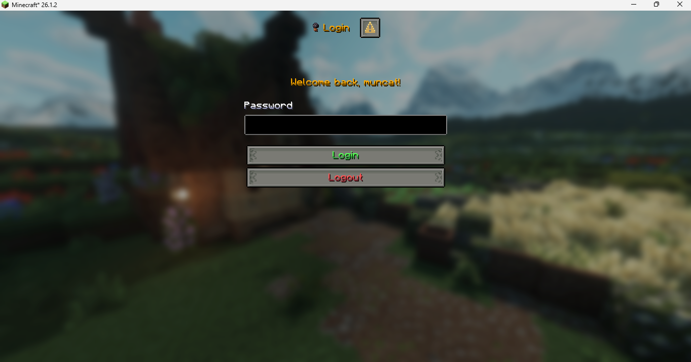

</details>

<details>
<summary>Register</summary>

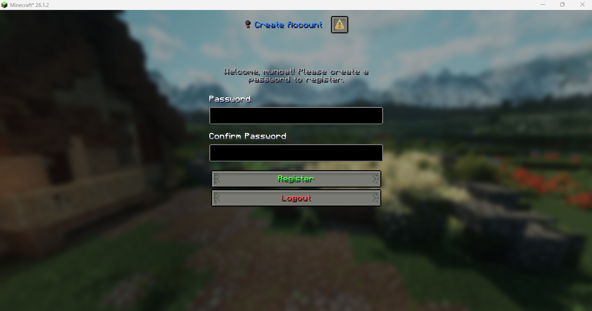

</details>

<details>
<summary>Rules</summary>

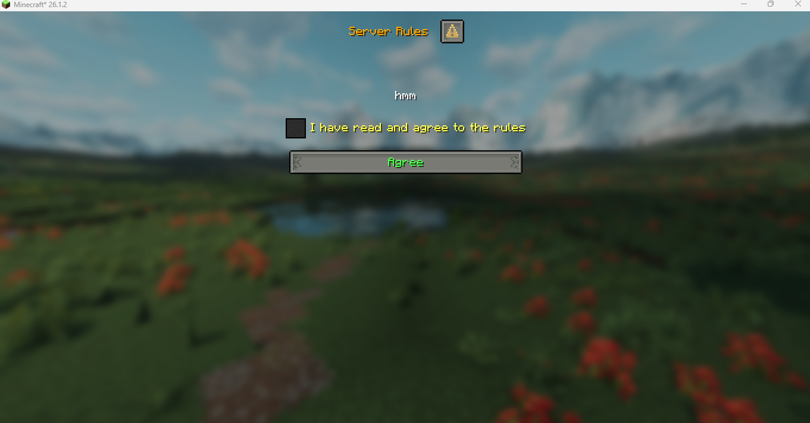

</details>

<details>
<summary>Captcha</summary>

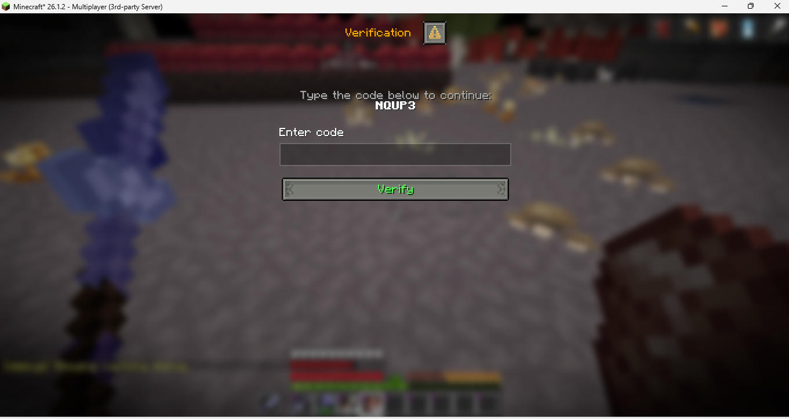

</details>

<details>
<summary>2FA</summary>

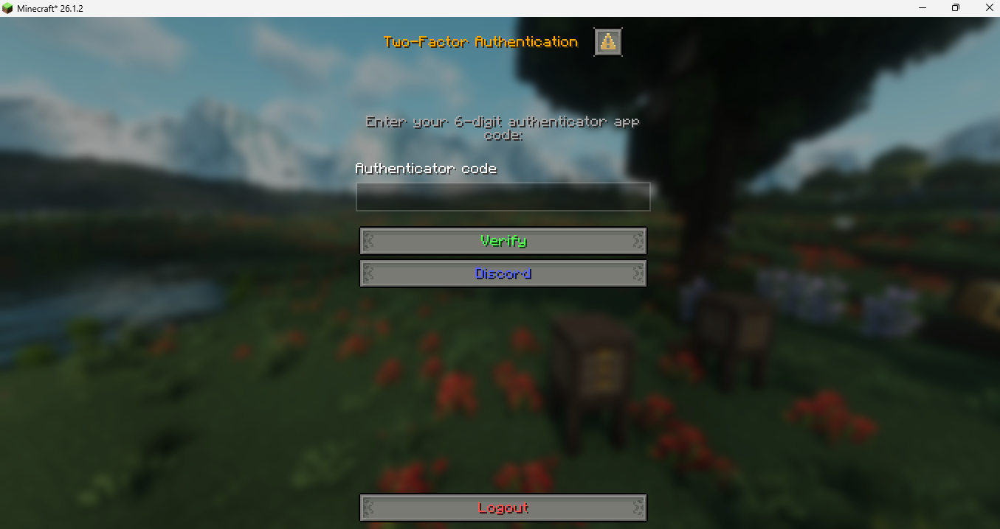

</details>

<details>
<summary>Email Verification</summary>

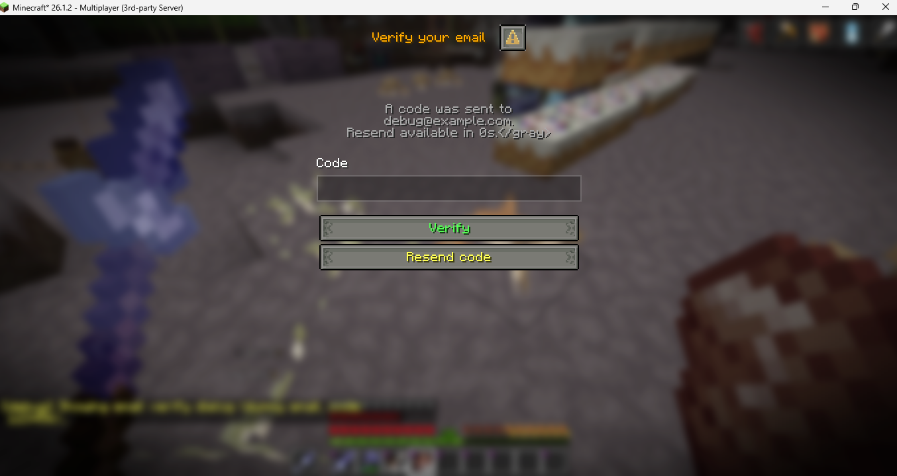

</details>

<details>
<summary>Add Email</summary>

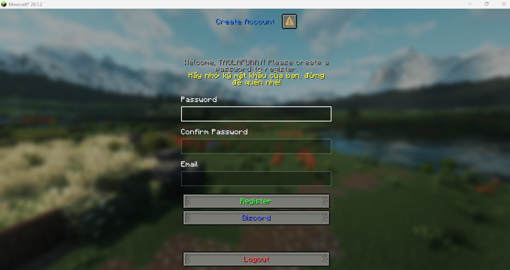

</details>

<details>
<summary>Password Recovery</summary>

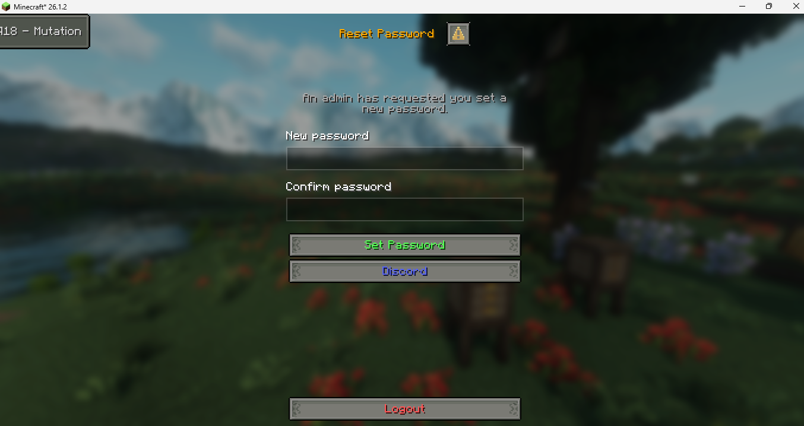

</details>

<details>
<summary>Forgot Password but email not found dialog</summary>

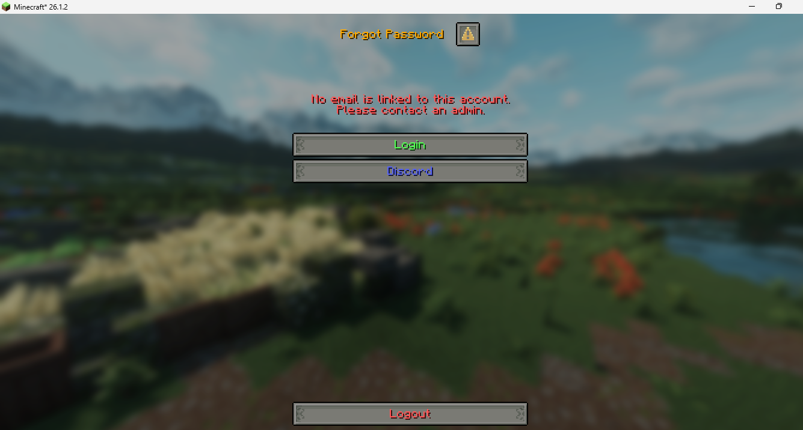

</details>

<details>
<summary>Login Timeout</summary>

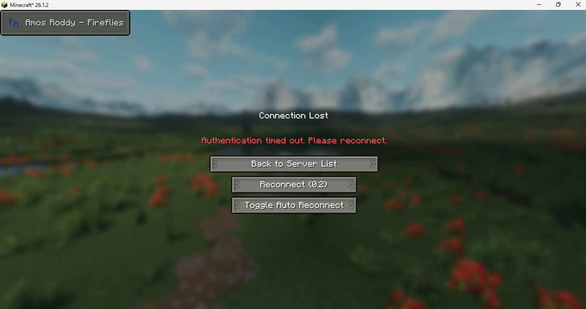

</details>

<details>
<summary>Buttons / Links</summary>

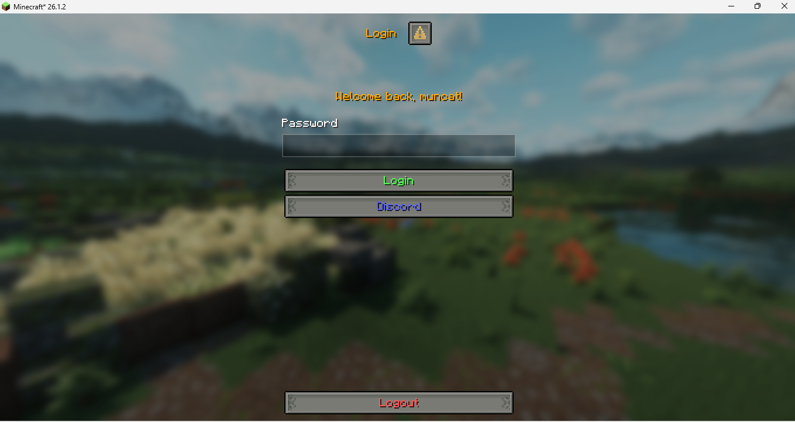

</details>

---

## Requirements

- Paper 1.21.6 or newer
- AuthMe Reloaded 6.0.0
- Java 21

**Optional, only needed for specific features:**
- Floodgate — required for `auto.bedrock_autologin` and the Bedrock dialog overrides (`dialog.bedrock`)
- ItemsAdder / NexoMC / Oraxen — only needed if the corresponding `integrations.*` entry is enabled
- PlaceholderAPI — only needed if you want `%placeholder%` expansions inside config.yml/lang text; without it, `{player}` substitution and MiniMessage formatting still work normally

---

## Features

**Dialog modes**
- Pre-spawn dialog mode: the login or register window blocks the connection phase, so the player spawns already authenticated
- Post-spawn dialog mode: the window appears after the player joins the world
- Three auth input modes: password text field, numeric PIN grid, or per-digit slider
- **Old-client numpad fallback**: clients whose protocol version can't render dialogs at all (pre-1.21.6) get an inventory-GUI numpad instead when `auth_mode.mode` is `pin` or `slider`, since there's otherwise no way to type a code through AuthMe's plain chat commands. Works post-spawn only; uses the exact same wrong-code/attempt-limit/2FA logic as the normal PIN/slider dialog
- Button layout switch (`dialog.button_layout`): arrange the main action buttons vertically (stacked) or horizontally (side by side) in both the register and login dialogs

**Authentication**
- Premium bypass: players whose UUID matches a premium account stored in AuthMe are detected automatically and skip all dialogs entirely
- **Premium auto-login** (`auto.premium_autologin`, off by default): goes a step further than the premium bypass above — a matching premium UUID is automatically `forceRegister`'d (if needed) and `forceLogin`'d with no dialog at all, then shown a one-time mandatory password-set dialog so the account still has a real AuthMe password on file
- **Bedrock auto-login** (`auto.bedrock_autologin`, off by default): the same automatic login, but for Bedrock players connecting through Geyser/Floodgate. `auto.bedrock_mode` controls how much this trusts: `link` (default, safe) only applies if Floodgate reports the player's account as linked to a verified Java premium account; `geyser` (opt-in, unsafe unless Geyser's own online auth-type is enabled) trusts any Bedrock/Geyser connection with no linked-account check at all
- **Bedrock dialog support**: Bedrock players see the same register/login/recover/rule/captcha dialogs as Java players, reusing all the same logic. `dialog.bedrock` lets you optionally override button width, input width, and the auth input mode (password/PIN/slider) just for Bedrock clients, since some Bedrock devices have a smaller usable dialog area
- **Session auto-login** (`auto.session_autologin`, on by default): skips the dialog entirely for a returning player that AuthMe's own session feature (`settings.sessions.enabled`/`timeout` in AuthMe's own config.yml) would already authenticate by matching IP and timeout. This reproduces AuthMe's own session comparison rather than asking AuthMe whether it already decided, since AuthMe does not evaluate its session feature until later in the join than this plugin's dialog decision is made. Has no effect at all unless AuthMe's own session feature is also enabled
- TOTP / 2FA dialog for players who have an authenticator app set up in AuthMe
- Captcha dialog synced with AuthMe's captcha setting
- Email verification dialog on registration (reuses AuthMe's SMTP config)
- **Self-service "Forgot Password?"**: a button on the login dialog lets players reset their own password without an admin. It looks up the email already on file (set during email-verified registration), sends a reset code to it through AuthMe's SMTP config, and — once the code is verified — shows the same reset dialog used for admin-forced recovery. Accounts with no email on file are told to contact an admin instead
- Admin-forced password recovery: use `/bia recover <player>` to flag an account; the player is shown a reset dialog on their next login or immediately if they are already online. The reset dialog now follows `auth_mode.mode` (password/PIN/slider), matching the register and login dialogs instead of always showing a text field
- Server rules agreement checkbox shown to new players before their account is created
- Login attempt limit with kick after too many wrong passwords
- Login timeout with optional kick or re-show of the dialog
- IP ban with escalating ban durations after repeated failed logins across sessions

**Notifications**
- Custom toast notifications (`notifications.toasts`): show the small achievement-style popup in the corner of the screen on `first_register`, `first_login`, `first_message`, or `first_advancement`, with a configurable title, description, item icon, sound, and advancement frame (`task`/`goal`/`challenge`). Each toast only ever fires once per player
- `/bia notifier <toast> <player> show [seconds]` lets an admin preview any configured toast on an online player without touching its persisted "already shown" state, so testing never affects whether it fires for real later

**Third-party item plugin integrations**
- Optional, self-checking integrations with ItemsAdder, NexoMC, and Oraxen (`integrations.*`, all off by default). Each one only activates if the corresponding plugin is actually installed and its API is loadable; if it isn't, the integration quietly disables itself without affecting login/registration in any way

**Admin tools**
- Bypass list: players added with `/bia add` skip all dialogs and fall back to AuthMe's own commands
- Custom screens: define any number of dialog windows in config.yml and push them to any online player with `/bia screen <id> [player]`, or auto-show them on join with `trigger: postjoin`/`trigger: prejoin` instead of only on command. Screens can include an optional agreement checkbox (`checkbox_label`/`checkbox_action`) that permanently suppresses the screen for a player once ticked and dismissed; reset it with `/bia screen reset <player> [id]`
- Debug commands: preview individual dialogs in-game without going through the full login flow
- Startup check that warns in the console if AuthMe's own built-in dialog (`settings.registration.dialog.preJoin/postJoin.enable`) is also enabled, to prevent two dialogs from appearing at once

**Extras**
- **Custom inline icons** (`custom_icons` + `<icons:name>`): define named icons (atlas sprites, player heads, or full item icons) once in config.yml, then drop `<icons:name>` anywhere inside any dialog title, content, or button label to show it inline. Item-type icons can also be shown above a custom screen's content via that screen's `icon:` field
- PlaceholderAPI support: any config.yml or lang text field can use `%placeholder%` expansions from installed PlaceholderAPI extensions (e.g. LuckPerms prefixes, Vault ranks), on top of the plugin's own `{player}` substitution and MiniMessage formatting. Only active while rendering text for a specific player, and never throws or blocks if PlaceholderAPI is not installed
- Link buttons inside dialogs (open URL, copy to clipboard)
- Per-button click sounds: nearly every dialog button (submit, logout, agree, verify, resend, forgot password, custom screen buttons, etc.) can play its own Minecraft sound on click
- Discord webhook notification on player join or first registration
- Welcome image sent to the player after first login
- ViaVersion support: players on older protocol versions fall back to AuthMe's normal flow automatically
- Folia support: detects Folia at startup and automatically switches to its region-aware scheduler instead of the standard Bukkit scheduler

---

## Commands

| Command | Permission | Description |
|---|---|---|
| `/bia reload` | OP | Reload config and lang |
| `/bia info` | - | Show plugin version and status |
| `/bia add <player>` | `authmebia.bypass` | Add player to bypass list |
| `/bia rm <player>` | `authmebia.bypass` | Remove player from bypass list |
| `/bia recover <player>` | `bia.admin.recover` | Force password reset on next login |
| `/bia screen <id> [player]` | OP | Show a custom screen to a player |
| `/bia screen reset <player> [id]` | OP | Reset a player's "closed forever" checkbox for a custom screen (omit `id` to reset all screens) |
| `/bia debug <feature> <true\|false\|show>` | OP | Test features in-game |
| `/bia notifier <toast> <player> show [seconds]` | OP | Preview a configured toast on an online player without affecting its once-per-player state |

Debug features: `captcha`, `email`, `register`, `login`, `recover`, `rule`.
Use `show` with `captcha` or `email` to preview those dialogs directly without going through the login flow.

---

## AuthMe API used

AuthMeBia hooks into AuthMe Reloaded through reflection rather than a compile-time API dependency, so it stays compatible across minor AuthMe builds without recompiling.

| Class | Usage |
|---|---|
| `fr.xephi.authme.api.v3.AuthMeApi` | Core operations: isRegistered, forceLogin, forceRegister, forceLogout, checkPassword, changePassword, isAuthenticated, registerPlayer, getLastIp, getLastLoginTime |
| `fr.xephi.authme.data.auth.PlayerAuth` | Read player data: isPremium, getPremiumUuid, getEmail, getTotpKey, setEmail |
| `fr.xephi.authme.data.auth.PlayerCache` | isAuthenticated(name) — used for in-memory authentication checks |
| `fr.xephi.authme.datasource.DataSource` | Fetch PlayerAuth records (getAuth), check `auto.session_autologin` state (hasSession), persist email changes (updateEmail) |
| `fr.xephi.authme.mail.EmailService` | Check SMTP availability, send verification codes |
| `fr.xephi.authme.security.totp.TotpAuthenticator` | Verify TOTP codes for 2FA dialog (`checkCode(PlayerAuth, String)`) |
| `fr.xephi.authme.events.LoginEvent` | Detect successful login to complete async futures |
| `fr.xephi.authme.events.RegisterEvent` | Detect successful registration |
| `fr.xephi.authme.events.FailedLoginEvent` | Detect failed login |

AuthMeBia also optionally bridges to Floodgate's API the same way (reflection, no compile-time dependency), only when `auto.bedrock_autologin` or a Bedrock dialog override is in use:

| Class | Usage |
|---|---|
| `org.geysermc.floodgate.api.FloodgateApi` | Detect Floodgate/Bedrock connections |
| `org.geysermc.floodgate.api.player.FloodgatePlayer` | Look up a Bedrock player's linked account |
| `org.geysermc.floodgate.util.LinkedPlayer` | Read the verified linked Java UUID, if any |

---

## Building from source

### Clone

```bash
git clone https://github.com/Mytai20100/authmebia.git
cd authmebia
```

### IntelliJ IDEA (recommended)

1. Open IntelliJ IDEA and choose **Open**, then select the `authmebia` folder.
2. IntelliJ will detect the Gradle project automatically and import it.
3. Wait for the Gradle sync to finish and dependencies to download.
4. Open the **Gradle** panel (right side) and run `Tasks > shadow > shadowJar`.
5. The output jar is in `build/libs/`.

### Command line

```bash
./gradlew shadowJar
```

The built jar is placed in `build/libs/`. Copy it to your server's `plugins/` folder alongside AuthMe Reloaded.

---

## Configuration

<details>
<summary>config.yml</summary>

```yaml
# AuthMeBia configuration.
# Text fields support MiniMessage color/decoration tags, e.g. <red>, <#ff0000>, <bold>.
# Use {player} as a placeholder for the player's name where supported.
# Use \n inside a string to insert a line break.

# Language code for messages (disconnect/kick, errors, chat).
# Built-in options: en (English), vi (Vietnamese).
# To add your own, copy plugins/AuthMeBia/lang/en.yml to lang/<code>.yml and edit it.
# Reload with /bia reload.
lang: en

# Automatic authentication skip for already-verified identities.
# Both flags default to false. With both false, behavior is identical to not
# having this section at all.
auto:
  premium_autologin: false
  bedrock_autologin: false
  # link (default, safe) or geyser (unsafe unless Geyser's own online
  # auth-type is enabled -- see the full comment in config.yml)
  bedrock_mode: link
  # Skips the dialog for a player already authenticated by AuthMe's own
  # session feature. No effect unless AuthMe's settings.sessions.enabled
  # is also true. Default: true.
  session_autologin: true

dialog:
  enabled: true
  menu: true
  min_protocol_version: 771
  button_width: 200
  # vertical (stacked) or horizontal (side by side)
  button_layout: vertical
  input_width: 200

  register:
    title: "<icons:trial_key> <#4287f5>Create Account</#4287f5>"
    content: ""
    password_label: "Password"
    confirm_password_label: "Confirm Password"
    submit_sound: ""

  login:
    title: "<icons:trial_key> <gold>Login</gold>"
    content: "<gold>Welcome back, {player}!</gold>"
    password_label: "Password"
    submit_sound: ""

    forgot_password:
      # Self-service password reset via the email already on file.
      # Requires email.enabled so an email is stored on the account.
      enabled: false
      button: "<yellow>Forgot Password?</yellow>"
      button_sound: ""
      email_title: "<gold>Forgot Password</gold>"
      email_content: "<gray>Enter the email address registered to this account.</gray>"
      email_label: "Email"
      submit_button: "<green>Send Code</green>"
      submit_sound: ""
      invalid_email_error: "Incorrect email"
      no_email_message: "<red>No email is linked to this account. Please contact an admin.</red>"

  logout_button: "<red>Logout</red>"
  logout_sound: ""
  submit_register_button: "<green>Register</green>"
  submit_login_button: "<green>Login</green>"
  allow_close: true
  # Only used when allow_close is false; delay in ticks before re-checking
  # and re-showing an in-game dialog the player closed without a click.
  reopen_delay_ticks: 10

  # Optional overrides applied only to Bedrock (Geyser/Floodgate) players.
  # Leave enabled: false to keep Bedrock identical to Java.
  bedrock:
    enabled: false
    button_width: 300
    input_width: 300
    # "" = inherit auth_mode.mode. Options: "", password, pin, slider
    auth_mode_override: ""

auth_mode:
  # password | pin | slider
  mode: password

  pin:
    length: 4
    title: "<gold>Enter your PIN</gold>"
    confirm_button: "<green>Confirm</green>"
    delete_button: "<red>⌫ Delete</red>"
    button_width: 100
    button_sound: ""

  slider:
    length: 4
    title: "<gold>Enter your code</gold>"
    confirm_button: "<green>Confirm</green>"
    button_width: 100
    button_sound: ""

rule:
  enabled: false
  title: "<gold>Server Rules</gold>"
  content: ""
  checkbox_label: "<yellow>I have read and agree to the rules</yellow>"
  agree_button: "<green>Agree</green>"
  agree_sound: ""

discord:
  enabled: false
  webhook_url: ""

welcome_image:
  enabled: false

links:
  enabled: false
  position: grouped
  button_width: 200
  buttons:
    - enabled: true
      label: "<#5865F2>Discord</#5865F2>"
      action: open_url
      value: "https://discord.gg/abc"
      width: 200
    - enabled: true
      label: "<gray>{player}, copy IP</gray>"
      action: copy
      value: "play.example.com"
      width: 200

captcha:
  enabled: false
  length: 5
  title: "<gold>Verification</gold>"
  content: "<gray>Type the code below to continue:</gray>\n<white><bold>{code}</bold></white>"
  input_label: "Enter code"
  submit_button: "<green>Verify</green>"
  submit_sound: ""
  trust_duration_seconds: 18000

login_attempts:
  enabled: true
  max_tries: 5

login_timeout:
  enabled: true
  seconds: 60
  kick_message: "<red>Authentication timed out. Please reconnect.</red>"

recover:
  title: "<gold>Reset Password</gold>"
  content: "<gray>An admin has requested you set a new password.</gray>"
  new_password_label: "New password"
  confirm_password_label: "Confirm password"
  submit_button: "<green>Set Password</green>"
  submit_sound: ""
  success_message: "<green>Password updated successfully.</green>"
  mismatch_message: "<red>Passwords do not match. Try again.</red>"

# Password-set dialog shown once, the first time a player joins via
# auto.premium_autologin or auto.bedrock_autologin. Has no effect if both
# of those are false.
premium:
  title: "<gold>Set Your Password</gold>"
  content: "<gray>You were signed in automatically. Please set a password for your account (used if you ever join from a non-verified client).</gray>"
  new_password_label: "New password"
  confirm_password_label: "Confirm password"
  submit_button: "<green>Set Password</green>"
  submit_sound: ""
  success_message: "<green>Password set successfully.</green>"
  mismatch_message: "<red>Passwords do not match. Try again.</red>"

email:
  enabled: false
  code_length: 6
  resend_cooldown: 60
  field_label: "Email"
  verify_title: "<gold>Verify your email</gold>"
  verify_content: "<gray>A code was sent to {email}.\nResend available in {cooldown}s.</gray>"
  code_label: "Code"
  verify_button: "<green>Verify</green>"
  verify_sound: ""
  resend_button: "<yellow>Resend code</yellow>"
  resend_sound: ""
  resend_button_cooldown: "<gray>Resend ({cooldown}s)</gray>"
  invalid_email_message: "<red>Please enter a valid email address.</red>"
  send_failed_message: "<red>Could not send the email. Please contact an admin.</red>"
  wrong_code_error: "Incorrect code"

totp_2fa:
  # Shows a 2FA dialog after login if the player has TOTP enabled in AuthMe.
  # Requires AuthMe 5.6+.
  enabled: false
  title: "<gold>Two-Factor Authentication</gold>"
  content: "<gray>Enter your 6-digit authenticator app code:</gray>"
  input_label: "Authenticator code"
  submit_button: "<green>Verify</green>"
  submit_sound: ""
  wrong_code_error: "Invalid code"

# Custom dialog screens. Show with: /bia screen <id> [player]
# Reset a player's "closed forever" checkbox: /bia screen reset <player> [id]
# Button actions: close, open_url, copy, command, console
custom_screens:
  - id: example
    enabled: true
    title: "<icons:trial_key> <gold>Server Notice</gold>"
    content: "<gray>Welcome to the server, {player}!\nHave fun playing.</gray>"
    allow_close: true
    button_width: 200
    # command (default), postjoin, or prejoin -- see doc/README.md
    trigger: command
    sound_on_show: ""
    # Optional agreement checkbox -- see doc/README.md for checkbox_action
    checkbox_label: "<gray>Don't show this again</gray>"
    checkbox_action: close
    buttons:
      - label: "<green>OK</green>"
        action: close
        sound: ""
      - label: "<#5865F2>Discord</#5865F2>"
        action: open_url
        value: "https://discord.gg/abc"
        width: 200

ip_ban:
  enabled: false
  threshold: 10
  ban_durations_seconds: [600, 1800, 3600, 86400]

# Named icons usable inline anywhere via <icons:name> (titles, content,
# button labels, custom screen text, etc.) -- see doc/README.md for the
# full sprite/player_head/item field reference.
custom_icons:
  trial_key:
    type: sprite
    atlas: items
    sprite: item/trial_key

config_version: 2
```

</details>

<details>
<summary>notifications.toasts and integrations</summary>

```yaml
# Custom toast notifications shown once per player per check.
notifications:
  toasts:
    - name: welcome_toast
      check: first_register
      title: "<gold>Welcome!</gold>"
      content: "<gray>Thanks for joining the server.</gray>"
      icon: "minecraft:player_head"
      sound: "minecraft:entity.player.levelup 0.6 1.0"
      delay: 5
      frame: task

# Optional integrations with third-party item/resource-pack plugins.
# Each self-checks whether the target plugin is installed; if not, it does
# nothing and never affects login/registration.
integrations:
  itemsadder:
    enabled: false
  nexomc:
    enabled: false
  oraxen:
    enabled: false
```

</details>